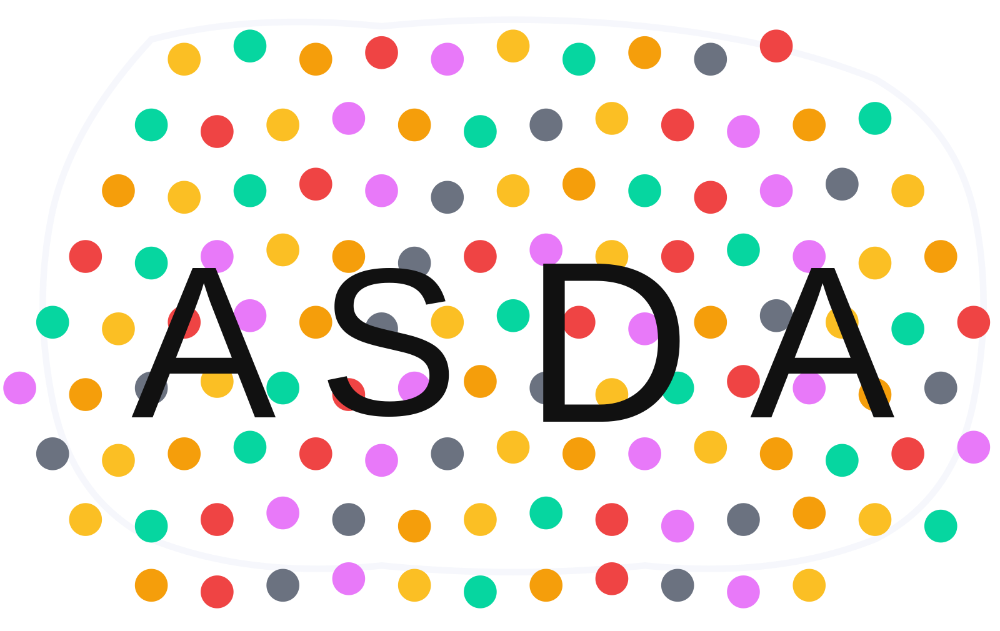

# Automated Spot Detection and Analysis



## Status: Under Review for Publication

This repository contains code that is currently under review for publication. Please read the LICENSE file carefully.

## Overview

This pipeline is designed to automatically detect, classify, and analyze colored spots in microscopy images. The tool provides a comprehensive GUI-based solution for spot detection using HSV color space analysis, with advanced clustering capabilities and statistical analysis. Originally developed for biological imaging applications where precise spot counting and spatial analysis are critical.

## Features

The pipeline includes an interactive GUI interface built with PyQt5 that makes spot analysis straightforward. It can detect and classify spots across 24+ predefined colors using HSV color space analysis, with an advanced clustering system that groups spots by color similarity when needed. The tool provides interactive ROI selection for marking injection sites, automatically preprocesses images by extracting foreground elements and detecting bounding boxes, then performs comprehensive statistical analysis of distances and neighbor relationships. 

Results are exported to Excel spreadsheets with detailed measurements, while the visualization system generates annotated images with arrows and overlays. The statistical analysis includes violin plots with significance testing to help interpret the data.

## Dependencies

```python
- PyQt5
- OpenCV (cv2)
- NumPy
- Pandas
- Matplotlib
- Seaborn
- scikit-image
- scipy
- scikit-learn
- tqdm
```

## Installation Requirements

```bash
pip install PyQt5 opencv-python numpy pandas matplotlib seaborn scikit-image scipy scikit-learn tqdm
```

## File Structure

The application creates organized output directories:
```
output_directory/
├── [image_name]/
│   ├── [image_name]_spot_analysis.xlsx
│   ├── [image_name]_spot_analysis_overview_arrows.png
│   ├── [image_name]_spot_analysis_[color]_arrows.png
│   ├── [image_name]_spot_analysis_[color].png
│   ├── [image_name]_distance_distribution.svg
│   ├── [image_name]_neighbor_distribution.svg
│   └── [image_name]_same_color_distribution.svg
```

## Input Image Requirements

- **Supported formats**: .png, .jpg, .jpeg, .tif, .tiff
- **Color space**: RGB images (RGBA automatically converted)
- **Resolution**: Any resolution supported
- **Image quality**: High contrast recommended for optimal spot detection


## Configuration Parameters

The basic settings include adjusting the key fraction (defaults to 0.25), which determines what proportion of the image width is used for color key detection. There's also a buffer parameter (default 50 pixels) that controls the pixel buffer for key region exclusion, and a debug mode that enables additional diagnostic output when you need to troubleshoot detection issues.

For more advanced usage, you can set the number of K-means clusters for color grouping, setting this to 0 disables clustering entirely. The system also includes customizable distance thresholds for spot merging and classification, along with area filters that set minimum and maximum area constraints for spot validation.

## Usage Instructions

### 1. Launch Application
```bash
python spot_analysis.py
```

### 2. Load Input Image
- Click "Browse" next to "Input Image"
- Select your microscopy image file
- Image appears in left panel

### 3. Select Output Directory
- Click "Browse" next to "Output Dir"
- Choose destination folder for results

### 4. Configure Parameters
- Adjust "Key Fraction" and "Buffer" as needed
- Set "K-Means Clusters" if clustering desired
- Enable "Debug" for detailed console output

### 5. Mark Injection Site
- Draw a small rectangle around the injection point
- Click "Select Injection Site"
- Confirm the selection in the dialog

### 6. Run Analysis
- Click "Run Analysis"
- Monitor progress in console and progress bar
- Results appear in right panel when complete

## Output Description

### Excel Spreadsheet
Contains detailed measurements for each detected spot:
- **Spot_ID**: Unique identifier within color group
- **Centroid_X/Y**: Pixel coordinates of spot center
- **Area**: Spot area in pixels
- **Distance_to_Injection**: Euclidean distance from injection site
- **Nearest_Neighbor_Distance**: Distance to closest spot of any color
- **Nearest_Neighbor_Color**: Color of nearest neighboring spot
- **Nearest_Same_Color_Distance**: Distance to nearest spot of same color
- **Intensity**: Average pixel intensity of spot region

### Visualization Images
- **No-arrows images**: Spots marked with colored circles and IDs
- **Arrow images**: Spots connected to injection site with directional arrows
- **Overview image**: All colors displayed together with arrows

### Statistical Plots
- **Distance Distribution**: Violin plots showing distance to injection site by color
- **Neighbor Distribution**: Analysis of inter-spot distances
- **Same-Color Distribution**: Clustering analysis within color groups
- **Significance Testing**: Mann-Whitney U tests with significance markers

### File Output Structure
```
[image_name]_spot_analysis.xlsx
[image_name]_spot_analysis_overview_arrows.png
[image_name]_spot_analysis_[color]_arrows.png
[image_name]_spot_analysis_[color].png
[image_name]_distance_distribution.svg
[image_name]_neighbor_distribution.svg
[image_name]_same_color_distribution.svg
```

## Performance Considerations

Memory usage scales linearly with image size, so larger images will use more RAM during processing. Processing time depends mainly on image complexity and how many spots are detected - more spots means longer analysis times. Currently the tool handles one image at a time rather than batch processing.

## Limitations

Right now the tool processes one image at a time rather than offering batch processing capabilities. Memory usage can get pretty high with very large images, and processing time increases with the number of detected spots. You also need to manually select the injection site for each image rather than having it detected automatically.

## License

This code is under a temporary license during the review period. See the LICENSE file for the full terms.
